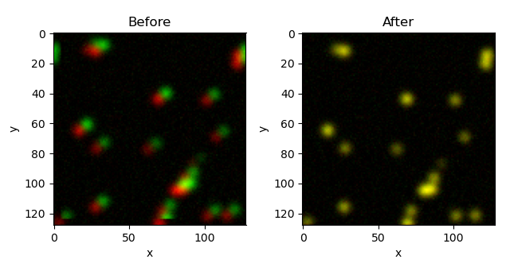
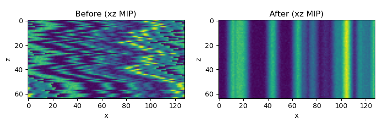

# FFTRegGPU.jl
[](https://github.com/urlicht/FFTRegGPU.jl/actions/workflows/ci.yml)

Fast FFT GPU registration using [phase correlation](https://en.wikipedia.org/wiki/Phase_correlation). This GPU version is based on [SubpixelRegistration.jl](https://github.com/romainFr/SubpixelRegistration.jl)  
Currently it only supports translation.


## Usage and example  



### Backend setup
Load FFTRegGPU with the backend package you want to use:

```julia
using FFTRegGPU
using FFTW    # CPU backend
# using CUDA  # CUDA backend
```

Backend selection is determined by array type at call time:
- `CuArray` inputs use the CUDA extension (CUFFT/CUDA kernels).
- `Array`/`StridedArray` inputs use the CPU extension (FFTW).
- You can load both `CUDA` and `FFTW`; dispatch still follows the input array types.

### Registering a set of 2D images
```julia
# allocate GPU memory
img1_g = CuArray{Float32}(undef, size_x, size_y)
img2_g = CuArray{Float32}(undef, size_x, size_y)
img1_f_g = CuArray{Complex{Float32}}(undef, size_x, size_y)
img2_f_g = CuArray{Complex{Float32}}(undef, size_x, size_y)
CC_g = CuArray{Complex{Float32}}(undef, size_x, size_y)
N_g = CuArray{Float32}(undef, size_x, size_y)
img2_reg_g = CuArray{Float32}(undef, size_x, size_y)

# copy to GPU
copyto!(img1_g, Float32.(img1))
copyto!(img2_g, Float32.(img2))

# perform FFT using the active backend
img1_f_g .= fft(img1_g)
img2_f_g .= fft(img2_g)

# register (find the optimal translation)
error, shift, diffphase = dftreg!(img1_f_g, img2_f_g, CC_g)

# resample the moving image (in-place)
dftreg_resample!(img2_reg_g, img2_f_g, N_g, shift, diffphase)

# copy to CPU
Array(img2_reg_g)
```
### Registering a set of 2D images (subpixel registration)
Use the function `dftreg_subpix!`. For the argument `CC2x_g`, the array size should be 2x of the image size.
```julia
# allocate GPU memory
img1_g = CuArray{Float32}(undef, size_x, size_y)
img2_g = CuArray{Float32}(undef, size_x, size_y)
img1_f_g = CuArray{Complex{Float32}}(undef, size_x, size_y)
img2_f_g = CuArray{Complex{Float32}}(undef, size_x, size_y)
CC2x_g = CuArray{Complex{Float32}}(undef, 2 * size_x, 2 * size_y)
N_g = CuArray{Float32}(undef, size_x, size_y)
img2_reg_g = CuArray{Float32}(undef, size_x, size_y)

# copy to GPU
copyto!(img1_g, Float32.(img1))
copyto!(img2_g, Float32.(img2))

# perform FFT using the active backend
img1_f_g .= fft(img1_g)
img2_f_g .= fft(img2_g)

# register (find the optimal translation)
error, shift, diffphase = dftreg_subpix!(img1_f_g, img2_f_g, CC2x_g)

# resample the moving image (in-place)
dftreg_resample!(img2_reg_g, img2_f_g, N_g, shift, diffphase)

# copy to CPU
Array(img2_reg_g)
```

### Registering z-stack
- Moving targets on the stage can cause shearing in z-stack. To correct this, the images within the stack are registered together.
- `reg_stack_translate!` is a memory-efficient and convenient function to register the frames in each z-stack. Here in the example, the script loads the z-stack at each time point, registers it, and then saves the registered z-stack.  
- To ensure this runs on CUDA: make all working arrays `CuArray`, check `CUDA.functional()`, and optionally set `CUDA.allowscalar(false)` to catch accidental scalar fallback.
- For repeated large host<->device transfers, use a long-lived pinned host buffer (`CUDA.pin`) for better copy throughput.
```julia
size_x, size_y, size_z = 256, 256, 94
img_stack_h = CUDA.pin(Array{Float32}(undef, size_x, size_y, size_z))
img_stack_reg_g = CuArray{Float32}(undef, size_x, size_y, size_z)
img1_f_g = CuArray{Complex{Float32}}(undef, size_x, size_y)
img2_f_g = CuArray{Complex{Float32}}(undef, size_x, size_y)
CC2x_g = CuArray{Complex{Float32}}(undef, 2 * size_x, 2 * size_y)
N_g = CuArray{Float32}(undef, size_x, size_y)

@showprogress for t = 1:100
    get_zstack!(img_stack_h, t) # load data to pinned host buffer
    copyto!(img_stack_reg_g, img_stack_h) # copy data to GPU
    reg_stack_translate!(img_stack_reg_g, img1_f_g, img2_f_g, CC2x_g, N_g) # register
    copyto!(img_stack_h, img_stack_reg_g) # copy result to CPU
    save_zstack(t, img_stack_h)
end
```

### Registering z-stack in batches (CUDA, higher throughput)
If you have many stacks (`t = 1:nt`), process them in micro-batches to improve GPU utilization and overlap CPU I/O with GPU work.

```julia
using FFTRegGPU
using CUDA
using ProgressMeter
using Base.Threads

CUDA.functional() || error("CUDA is not functional")
CUDA.allowscalar(false)

size_x, size_y, size_z = 256, 256, 94
nt = 100
B = 4  # micro-batch size; tune 2, 4, 8...

# One independent workspace per batch slot.
h_in = [CUDA.pin(Array{Float32}(undef, size_x, size_y, size_z)) for _ in 1:B]
h_out = [CUDA.pin(Array{Float32}(undef, size_x, size_y, size_z)) for _ in 1:B]
d_stack = [CuArray{Float32}(undef, size_x, size_y, size_z) for _ in 1:B]
img1_f = [CuArray{ComplexF32}(undef, size_x, size_y) for _ in 1:B]
img2_f = [CuArray{ComplexF32}(undef, size_x, size_y) for _ in 1:B]
CC2x = [CuArray{ComplexF32}(undef, 2 * size_x, 2 * size_y) for _ in 1:B]
N = [CuArray{Float32}(undef, size_x, size_y) for _ in 1:B]
reg_param = [Dict{Int,Any}() for _ in 1:B]

@showprogress for t0 in 1:B:nt
    k = min(B, nt - t0 + 1)

    # Load stacks on CPU.
    @threads for i in 1:k
        get_zstack!(h_in[i], t0 + i - 1)
    end

    # Process stacks concurrently on GPU.
    @sync for i in 1:k
        @spawn begin
            empty!(reg_param[i])
            CUDA.@sync begin
                copyto!(d_stack[i], h_in[i]) # H2D
                reg_stack_translate!(d_stack[i], img1_f[i], img2_f[i], CC2x[i], N[i]; reg_param=reg_param[i])
                copyto!(h_out[i], d_stack[i]) # D2H
            end
        end
    end

    # Save stacks on CPU.
    @threads for i in 1:k
        save_zstack(t0 + i - 1, h_out[i])
    end
end
```

Notes:
- Run Julia with multiple threads (e.g. `julia -t auto`) to benefit from `@threads`/`@spawn`.
- `B` is the main tuning parameter; increase it until throughput stops improving or GPU memory becomes limiting.

## Performance
### Benchmark command
```bash
julia --project=benchmark benchmark/run_benchmarks.jl --backend=both --samples=20 --sizes=64x64,128x128,256x256,512x512,2048x2048 --stack=128x128x128,256x256x256 --output=benchmark/results/both.csv
```

### Benchmark results
Time in ms

| backend | case | dims | median | mean | min | memory | allocs |
| :--- | :--- | :--- | ---: | ---: | ---: | ---: | ---: |
| cpu | dftreg | 64x64 | 0.060 | 0.066 | 0.059 | 400 | 7 |
| cpu | dftreg_subpix | 64x64 | 0.410 | 0.408 | 0.306 | 295408 | 247 |
| cpu | dftreg | 128x128 | 0.204 | 0.214 | 0.203 | 400 | 7 |
| cpu | dftreg_subpix | 128x128 | 3.687 | 3.661 | 3.331 | 968880 | 247 |
| cpu | dftreg | 256x256 | 2.970 | 2.978 | 2.960 | 400 | 7 |
| cpu | dftreg_subpix | 256x256 | 99.947 | 89.491 | 18.744 | 3493856 | 269 |
| cpu | dftreg | 512x512 | 17.416 | 17.440 | 17.333 | 400 | 7 |
| cpu | dftreg_subpix | 512x512 | 196.452 | 190.043 | 69.564 | 13262576 | 279 |
| cpu | dftreg | 2048x2048 | 258.009 | 258.358 | 256.690 | 400 | 7 |
| cpu | dftreg_subpix | 2048x2048 | 1790.361 | 1768.056 | 1710.282 | 204021056 | 279 |
| cpu | reg_stack_translate | 128x128x128 | 498.022 | 503.165 | 493.216 | 124292056 | 36460 |
| cpu | reg_stack_translate | 256x256x256 | 28044.507 | 28044.507 | 28044.507 | 895572952 | 79316 |
| cuda | dftreg | 64x64 | 0.683 | 0.760 | 0.586 | 15104 | 487 |
| cuda | dftreg_subpix | 64x64 | 1.412 | 1.409 | 0.986 | 118320 | 2051 |
| cuda | dftreg | 128x128 | 0.215 | 0.235 | 0.211 | 15008 | 474 |
| cuda | dftreg_subpix | 128x128 | 1.439 | 1.457 | 1.081 | 166896 | 2051 |
| cuda | dftreg | 256x256 | 0.220 | 0.241 | 0.215 | 15072 | 483 |
| cuda | dftreg_subpix | 256x256 | 1.495 | 1.510 | 1.065 | 263472 | 2076 |
| cuda | dftreg | 512x512 | 0.232 | 0.255 | 0.228 | 15152 | 492 |
| cuda | dftreg_subpix | 512x512 | 1.927 | 3.169 | 1.334 | 457184 | 2186 |
| cuda | dftreg | 2048x2048 | 1.845 | 1.849 | 1.589 | 24432 | 1028 |
| cuda | dftreg_subpix | 2048x2048 | 11.011 | 10.937 | 9.759 | 1622016 | 2752 |
| cuda | reg_stack_translate | 128x128x128 | 182.471 | 212.267 | 165.538 | 24102736 | 324324 |
| cuda | reg_stack_translate | 256x256x256 | 382.678 | 389.114 | 370.962 | 74343728 | 659790 |

### Configuration
```
CUDA toolchain: 
- runtime 13.2, artifact installation
- driver 570.181.0 for 13.2
- compiler 13.2

CUDA libraries: 
- CUBLAS: 13.3.0
- CURAND: 10.4.2
- CUFFT: 12.2.0
- CUSOLVER: 12.1.0
- CUSPARSE: 12.7.9
- CUPTI: 2026.1.0 (API 13.2.0)
- NVML: 12.0.0+570.181

Julia packages: 
- CUDA: 5.11.0
- GPUArrays: 11.4.1
- GPUCompiler: 1.8.2
- KernelAbstractions: 0.9.40
- CUDA_Driver_jll: 13.2.0+0
- CUDA_Compiler_jll: 0.4.2+0
- CUDA_Runtime_jll: 0.21.0+0

Toolchain:
- Julia: 1.12.5
- LLVM: 18.1.7

1 device:
  0: NVIDIA GeForce RTX 4060 Ti (sm_89, 15.581 GiB / 15.996 GiB available)
```
